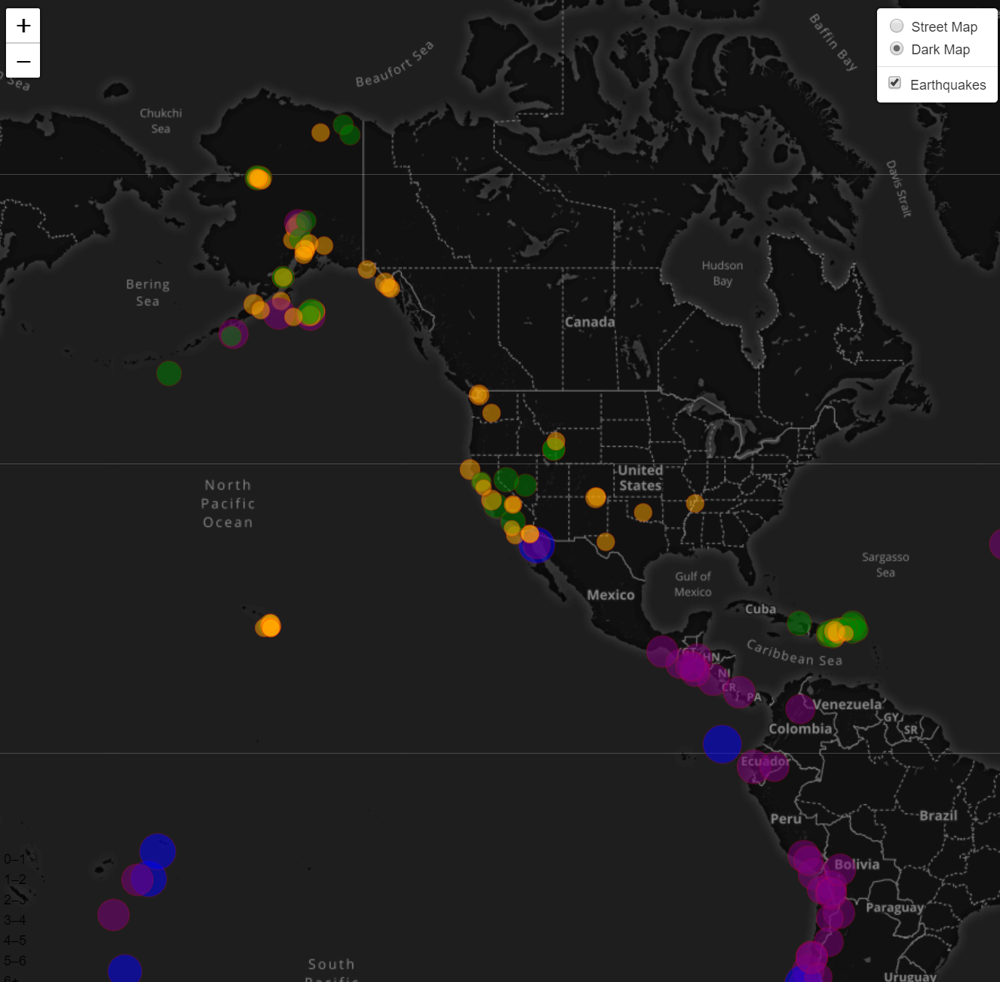
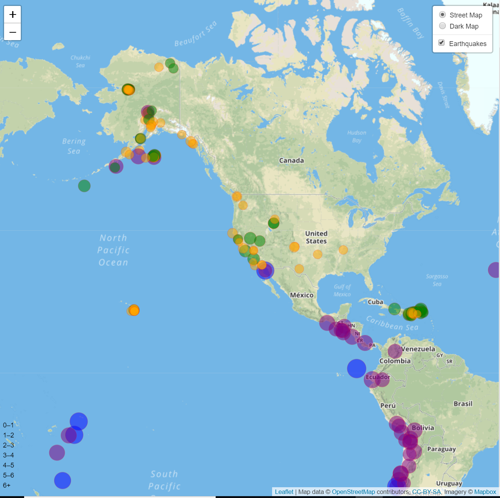

# Mapping with Leaflet.js

## Background

The United States Geological Survey (USGS) is responsible for providing scientific data about natural hazards, the health of our ecosystems and environment; and the impacts of climate and land-use change. Their scientists develop new methods and tools to supply timely, relevant, and useful information about the Earth and its processes. I will create geographical maps through JavaScript to visualize USGS' earthquake data in order to educate on this issues affecting the world.

## Get the data set
The USGS provides earthquake data in a number of different formats, updated every 5 minutes. I visited the [USGS GeoJSON Feed](http://earthquake.usgs.gov/earthquakes/feed/v1.0/geojson.php). The data used for the geographical mapping can be found here: https://earthquake.usgs.gov/earthquakes/feed/v1.0/summary/2.5_week.geojson

**Import & Visualize the Data**

   Create a map using Leaflet that plots all of the earthquakes from the data set based on their longitude and latitude- California was the central spot.

   * Markers reflect the magnitude of the earthquake in their size and color. Earthquakes with higher magnitudes should appear larger and darker in color.

   * Included popups that provide additional information about the earthquake when a marker is clicked.

   * Created a legend that provides context for the map data. The legend provides an option for a dark map as well.
   
## Mapping visualization samples from this project:

